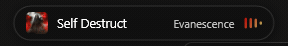
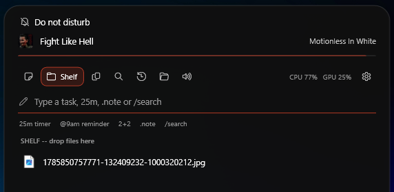
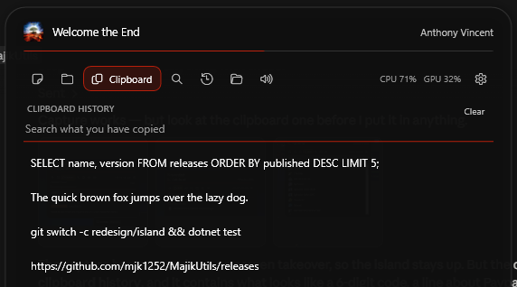

# MajikUtils

A set of Windows 11 utilities that live in an island at the top of the screen, built in WPF (.NET 9).

<p align="center">
  
</p>

<p align="center">
  <a href="https://mjk1252.github.io/MajikUtils/"><b>See it</b></a> &nbsp;·&nbsp;
  <a href="https://github.com/mjk1252/MajikUtils/releases/latest"><b>Download</b></a>
</p>

**The island** is the whole app. It hangs from the top edge of a monitor as a notch fused to the
screen edge or, if you prefer, a pill floating just below it — at either end of that edge or in the
middle, on whichever monitors you pick, or on all of them at once (*Settings*).

Collapsed, it shows whatever is playing. **Point at it** and it opens into the cover, a progress bar
and prev/play-pause/next — a glance, and nothing else. **Click it** and the rest appears: one text
box, a strip of scopes, and whichever scope is open.

### If you hide your taskbar

Auto-hiding the taskbar costs you two things. The island gives both back, since it hangs off the
same edge anyway:

- **The time** sits on the collapsed island, in whatever format the rest of Windows uses, with the
  date beside it when nothing is playing. With this on the island stays on screen rather than
  waiting to be pointed at — a clock you have to go looking for is not a clock.
- **The apps with something waiting** appear as icons just right of the clock, each with its count
  beside it. It reads three things at once — Windows' notification centre, the badges on your
  taskbar buttons, and any app flashing for attention — so an app that only does one of the three
  still shows up, whether or not the taskbar is on screen. Something arriving with nothing playing
  brings the island out and holds it there; reading it takes the icon away again. Three at a time,
  then a `+2` for the rest. An app that flashes without saying how many shows just its icon:
  Windows does not know the number either, and a made-up one would be worse than none.

Both are toggles in *Settings*.

### The box

Everything you type goes in one place, and what you type decides what it becomes:

| You type | What happens |
| --- | --- |
| `renew the domain` | a task, ticked off later |
| `25m` or `1h30` | a countdown |
| `@9am call Tom` | a countdown to that time, which says *call Tom* when it fires |
| `2 + 2` | works it out; Enter copies the answer |
| `pom` | a focus cycle: 25 on, 5 off, a long break every fourth |
| `.wifi is on the router` | a note |
| `/firefox` | searches your apps, stacks, recent files and clipboard |

A line under the box tells you which of those Enter is about to do, before you press it. Nothing
needs a prefix except the four that have one — an ordinary task is just an ordinary sentence.

Searching with `/` filters as you type; **up** and **down** choose a result and **Enter** opens it,
without your hands leaving the keyboard. `Ctrl+Alt+Space` opens the island straight into it.

### The scopes

- **Capture** — the box above, and a feed of what you have put through it. A running pomodoro or
  timer shows here too, with the phase, the time left and how much of the set is done.
- **Shelf** — a holding area for files. **Drag a file to the island** and it opens the shelf ready to
  drop into. Drag items back out whenever you need them.
- **Clipboard** — text, images and copied files, captured in the background. Search it, and **pin**
  anything worth keeping: a pin survives the list filling up, *Clear*, and a restart. Nothing else is
  ever written to disk. Drag a screenshot straight out into whatever wants it. `Ctrl+Alt+Shift+V`
  anywhere opens the island onto this.
- **Apps** — installed apps, or new ones found and installed via winget. An install shows its
  progress on the island rather than in a console window.
- **Recent files** and **Stacks** (which folders are stacks).
- **Mixer** — per-application volume.
- **The gear** — *Settings...* and *Exit MajikUtils*.

Pointing at the island opens it; clicking holds it open until you click away or press Esc. It never
takes focus until you ask it to, lets clicks through whenever its controls aren't showing, and gets
out of the way of full-screen apps.





One thing still lives on the taskbar:

- **One button per folder stack** — each stack you add gets its own taskbar button wearing that
  folder's own icon. Clicking it fans the folder's contents out in an arc right above the button,
  so a folder's files are one click from the taskbar. Right-click one and choose *Pin to taskbar*:
  a pinned stack is permanent one-click access to that folder, and its jump list adds *Open folder*
  for the contents the fan doesn't show, plus *Exit MajikUtils*. A pinned button works even when
  MajikUtils isn't running — clicking it starts it.

Note that Windows' own *Close window* entry only puts a stack away. It has to: a real close would
destroy the taskbar button along with the window. *Exit MajikUtils* is the one that quits.

## Icons

The exe icon is `assets/MajikUtils.ico`, built from `assets/icon-source.png` by
`tools/make-icon.ps1` — rerun that after changing the source art. It carries 16/24/32/48/64 as
BMP frames and 128/256 as PNG, which is the encoding split the Windows shell expects.

## Custom taskbar button icons

Drop your own artwork in `assets/icons/` (shipped with a build) or `%LOCALAPPDATA%\MajikUtils\icons\custom\`
(no rebuild needed, checked first). `stack-<folder>.png` for a stack — e.g. `stack-downloads.png`.
See [`assets/icons/README.md`](assets/icons/README.md) for sizes and the caveat about Windows
caching pinned button icons.

See [`docs/ARCHITECTURE.md`](docs/ARCHITECTURE.md) for project layout.

## Projects

- `src/Dock.App` — WPF UI: the island window, the panels it hosts, and the stack windows.
- `src/Dock.Core` — Pure C# models/services, no Win32 dependency, unit-testable.
- `src/Dock.Interop` — All P/Invoke and Win32 shell interop (shell icons, per-window
  AppUserModelIDs, clipboard hooks, system stats), isolated behind interfaces with safe fallbacks.
- `tests/Dock.Core.Tests` — Unit tests for `Dock.Core`.
- `installer/` — Inno Setup script for packaging.

## Building

```
dotnet build
```

For a release build and installer:

```
pwsh tools/build-release.ps1
```

That publishes to `publish/MajikUtils` (self-contained, ReadyToRun) and compiles
`dist/MajikUtils-Setup-<version>.exe`. Inno Setup 6 is needed for the installer step; note it
installs per-user by default, under `%LOCALAPPDATA%\Programs`, not Program Files.

## Requirements

- Windows 11
- .NET 9 SDK
